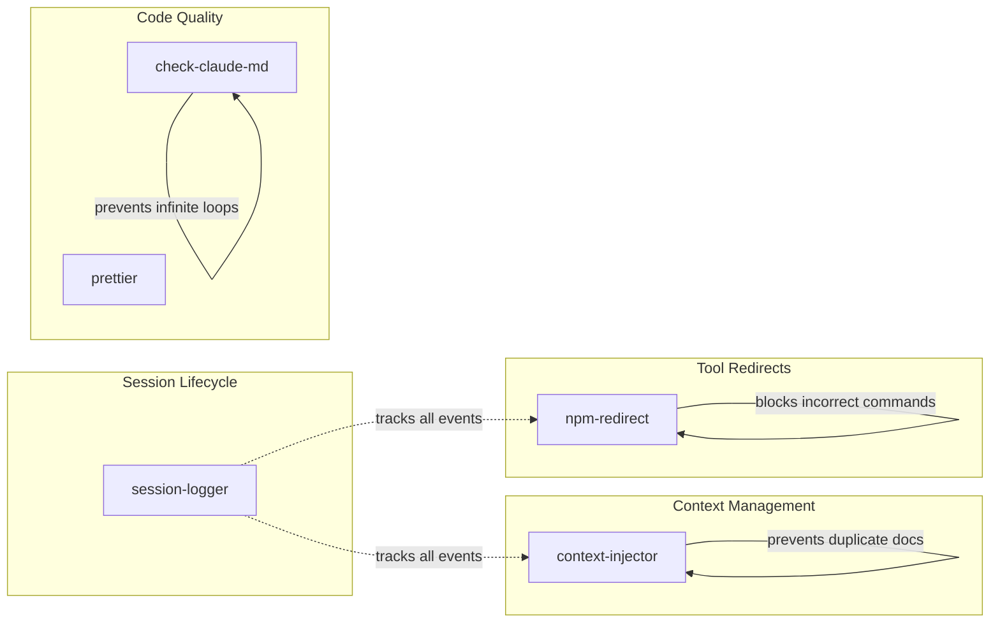

# Claude Code Global Settings

This project is symlinked to `~/.claude` and allows sharing global Claude Code settings between machines.

Custom directories (i.e., those not carrying Claude Code significance like `agents/` or `commands/`) are prefixed with `x-` for clarity and to avoid accidental name collision.

## Hooks Architecture

Claude Code hooks are orchestrated through `settings.json` and implemented as either:

- **TypeScript/Bun scripts** in `oven/bin/cc-hook--*.ts` (compiled to `~/.local/bin/`)
- **Shell scripts** in `x-hooks/` (local to claude directory)

### Hook Event Flow

```mermaid
graph TD
    Start[Session Start] -->|cc-hook--session-logger| Log1[Log session init]
    Start -->|cc-hook--context-injector| Init[Initialize context tracking]

    UserPrompt[User Prompt] -->|cc-hook--session-logger| Log2[Log user input]

    PreTool[Pre Tool Use] -->|cc-hook--npm-redirect| NPM[Redirect npm/npx/node commands]
    PreTool -->|cc-hook--session-logger| Log3[Log tool invocation]

    PostTool[Post Tool Use] -->|cc-hook--context-injector| Context[Inject AGENTS.md context]
    PostTool -->|prettier| Format[Format JSON/MD files]
    PostTool -->|cc-hook--session-logger| Log4[Log tool response]

    Stop[Stop Event] -->|cc-hook--session-logger| Log5[Log stop event]
    Stop -->|check-claude-md.sh| Check[Check documentation updates]

    End[Session End] -->|cc-hook--session-logger| Log6[Log session end]
    End -->|cc-hook--context-injector| Cleanup[Cleanup context tracking]
```



### Active Hooks

#### 1. **cc-hook--session-logger**

- **Summary**: Logs all Claude Code events to structured JSON files for analysis and debugging
- **Events**: All events (SessionStart, SessionEnd, PreToolUse, PostToolUse, UserPromptSubmit, Stop, SubagentStop, PreCompact, Notification)
- **Purpose**: Creates audit trail, enables session replay, supports analytics

#### 2. **cc-hook--context-injector**

- **Summary**: Injects relevant AGENTS.md documentation when files are read, with session-based deduplication
- **Events**: SessionStart (initialize), PostToolUse[Read] (inject context), SessionEnd (cleanup)
- **Purpose**: Provides contextual documentation without repetition, tracks seen documentation per session

#### 3. **cc-hook--npm-redirect**

- **Summary**: Intercepts npm/npx/node commands and redirects to the appropriate package manager (pnpm/bun/yarn)
- **Events**: PreToolUse[Bash]
- **Purpose**: Prevents package manager conflicts, ensures correct tool usage based on project lock files

#### 4. **prettier formatter**

- **Summary**: Auto-formats JSON and Markdown files after edits using Prettier
- **Events**: PostToolUse[Edit|MultiEdit|Write] for _.json and _.md files
- **Purpose**: Maintains consistent code formatting across the project

#### 5. **check-claude-md.sh**

- **Summary**: Prompts to review and update documentation after session changes
- **Events**: Stop (only when stop_hook_active is false to prevent loops)
- **Purpose**: Ensures documentation stays current with code changes

### Hook Interactions and Dependencies



### Data Flow Between Hooks

1. **Session State Sharing**:
   - `cc-hook--session-logger` creates session directories and transcript files
   - `cc-hook--context-injector` uses session ID to track which documentation has been shown
   - Both hooks use environment variables like `CLAUDE_PROJECT_DIR` and session IDs

2. **Event Cascading**:
   - Hooks don't directly communicate but process events in sequence
   - Each hook can block further execution (exit code 2) or allow continuation
   - `check-claude-md.sh` specifically checks `stop_hook_active` to prevent recursive triggers

3. **File System Coordination**:
   - Session logs stored in `~/.local/share/claude-logs/sessions/<date>/<session-id>/`
   - Context state stored in `/tmp/claude-context-<session-id>.json`
   - All hooks respect the project directory structure

### Hook Configuration Reference

Hooks are configured in `settings.json` with this structure:

```json
{
  "hooks": {
    "<EventName>": [
      {
        "matcher": "<ToolName>", // Optional: filter by tool
        "hooks": [
          {
            "type": "command",
            "command": "<command-to-execute>"
          }
        ]
      }
    ]
  }
}
```

### Development Guidelines

When developing new hooks:

1. Follow the naming convention: `cc-hook--<purpose>` for TypeScript hooks
2. Export a lib function for testing (e.g., `ccHookSessionLoggerLib`)
3. Use the shared types from `oven/shared/claude-hooks.ts`
4. Handle stdin for hook input and stdout for responses
5. Use exit code 2 to block operations with a reason
6. Consider session state and avoid infinite loops
