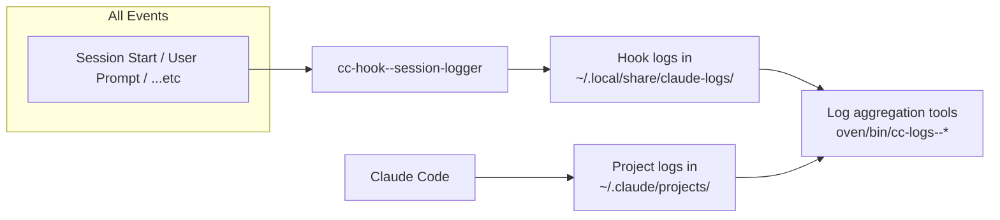

# Claude Code Global Settings

This project is symlinked to `~/.claude` and allows sharing global Claude Code settings between machines.

## Version Status

Custom directories (i.e., those not carrying Claude Code significance like `agents/` or `commands/`) are prefixed with `x-` for clarity and to avoid accidental name collision.

## Hooks Architecture

Claude Code hooks are orchestrated through `settings.json` and implemented as either:

- **TypeScript/Bun scripts** in `oven/bin/cc-hook--*.ts` (compiled to `~/.local/bin/`)
- **Shell scripts** in `claude/x-hooks/` (local to claude directory)

### Hook Event Flow


### Session Logging

All hook events are captured by `cc-hook--session-logger`:



### Log Aggregation Tools

The `oven/bin/cc-logs--*` commands provide analysis and aggregation of both hook logs and Claude Code project logs:

- **cc-logs--extract-dialogue**: Extract conversation dialogues from session logs
- **cc-logs--analyze-subagents**: Analyze subagent usage patterns and performance
- **cc-logs--extract-commit-dialogue**: Extract dialogues related to git commits
- **cc-logs--extract-agents**: Extract agent IDs with prompts and models for easy agent resumption

### Agent Resumption Workflow

Claude Code supports resuming Task agents from previous executions, allowing agents to continue work with full context. This is useful for:

- Continuing analysis after reviewing initial findings
- Adding follow-up work without re-executing expensive operations
- Building upon previous
- **IMPORTANT**: At this time claude code only resumes the initital context for an agent, i.e ask agent task A, then resume them and they will recall task A, but if you ask them task B, then resume again later, they won't remember task B, just task A. This is annoying!

### Active Hooks

#### 1. **cc-hook--session-logger**

- **Summary**: Logs all Claude Code events to structured JSON files for analysis and debugging
- **Events**: All events (SessionStart, SessionEnd, PreToolUse, PostToolUse, UserPromptSubmit, Stop, SubagentStop, PreCompact, Notification)
- **Purpose**: Creates audit trail, enables session replay, supports analytics

#### 2. **cc-hook--context-injector**

- **Summary**: Lists all README.md files in the project at session start
- **Events**: SessionStart (initialize and list READMEs), SessionEnd (cleanup)
- **Purpose**: Provides project documentation overview at session start. Note: AGENTS.md files are now automatically loaded by Claude Code

#### 3. **cc-hook--npm-redirect**

- **Summary**: Intercepts npm/npx/node commands and redirects to the appropriate package manager (pnpm/bun/yarn)
- **Events**: PreToolUse[Bash]
- **Purpose**: Prevents package manager conflicts, ensures correct tool usage based on project lock files

### Hook Interactions and Dependencies


### Data Flow Between Hooks

1. **Session State Sharing**:
   - `cc-hook--session-logger` creates session directories and transcript files
   - `cc-hook--context-injector` creates minimal session state for cleanup tracking
   - Both hooks use environment variables like `CLAUDE_PROJECT_DIR` and session IDs

2. **Event Cascading**:
   - Hooks don't directly communicate but process events in sequence
   - Each hook can block further execution (exit code 2) or allow continuation

3. **File System Coordination**:
   - Session logs stored in `~/.local/share/claude-logs/sessions/<date>/<session-id>/`
   - Context state stored in `/tmp/claude-agent-context-<session-id>.json`
   - All hooks respect the project directory structure

## Custom Slash Commands

### Naming Convention

To help find commands amongst, there are some common patterns:

- `prime-*`: Set up context for a specific task, allowing for more direct context loading than relying on a cross cutting CLAUDE.md file for implicit understanding
- `refine-*`: Have claude code undertake repetitive improvements like updating documentation

### Available Commands

#### /speak [optional initial message]

- **Location**: `claude/commands/speak.md`
- **Purpose**: Enable audio communication mode for the session
- **Usage**: Start an interactive audio conversation with Claude Code
- **Example**: `/speak` or `/speak Let's discuss the architecture`
- **Features**: Voice input/output, automatic transcription, continuous conversation mode

#### /refine-docs [sha1] [sha2] ...

- **Location**: `claude/commands/refine-docs.md`
- **Purpose**: Review and refine documentation based on code changes
- **Usage**:
  - Without arguments: Reviews documentation against current session changes
  - With git SHAs: Reviews documentation against specific commits (for retrospective updates)
- **Example**: `/refine-docs cdaa1fb 79f8137` - reviews changes from those two commits

### Hook Configuration Reference

Hooks are configured in `settings.json` with this structure:

```json
{
  "hooks": {
    "<EventName>": [
      {
        "matcher": "<ToolName>", // Optional: filter by tool
        "hooks": [
          {
            "type": "command",
            "command": "<command-to-execute>"
          }
        ]
      }
    ]
  }
}
```

### Development Guidelines

When developing new hooks:

1. Follow the naming convention: `cc-hook--<purpose>` for TypeScript hooks
2. Export a lib function for testing (e.g., `ccHookSessionLoggerLib`)
3. Use the shared types from `oven/shared/claude-hooks.ts`
4. Handle stdin for hook input and stdout for responses
5. Use exit code 2 to block operations with a reason
6. Consider session state and avoid infinite loops

## Experimental Features

### Project Context Injection with cindex

We're experimenting with using `cindex` to automatically inject project context into Claude Code sessions. This feature is under active development and the exact format is subject to heavy modification as we experiment with different approaches.

#### Current Approach

- **Tool**: `cindex` (located in `oven/bin/cindex.ts`)
- **Purpose**: Generate and inject project structure/context at session start
- **Format**: Currently experimenting with markdown-based project indices
- **Integration**: Exploring hook-based injection and command-based approaches

#### Usage Patterns Being Tested

```bash
# Generate project index with descriptions
cindex --markdown

# Generate focused index for specific paths
cindex --path <directory>

# Filter out less relevant files automatically
cindex --help  # See current experimental options
```

**Note**: The implementation details, output format, and integration methods are all experimental and will change frequently as we refine the approach for optimal context injection.
