# Multi-Agent Architecture Ways of Working (WoW)

## Overview

This document describes the complete system for multi-agent collaboration in Claude Code, focusing on how specialized agents work together to deliver high-quality software implementations from initial requirements through to verified production code.

## System Architecture

```mermaid
graph TD
    User[User Request] --> Architect[🏗️ Architect/Prime<br/>Requirements & Design]

    Architect --> Researcher[🔬 Researcher<br/>Best Practices]
    Architect --> Librarian[📚 Librarian<br/>Code Discovery]

    Architect --> Spec[📋 Specification<br/>specs/YYYY-MM-DD-feature.md]

    Spec --> Dev[👨‍💻 Senior Dev<br/>Implementation]
    Architect --> QA[✅ QA Tester<br/>Verification]

    Dev --> Architect
    QA --> Architect

    Architect --> Commit[Git Commit]

    %% Theme classes for clarity and contrast
    classDef orchestrator fill:#2563eb,stroke:#1e3a8a,stroke-width:2px,color:#ffffff;
    classDef artifact fill:#facc15,stroke:#92400e,stroke-width:2px,color:#111111;
    classDef implement fill:#f59e0b,stroke:#7c2d12,stroke-width:2px,color:#111111;
    classDef verify fill:#10b981,stroke:#065f46,stroke-width:2px,color:#111111;
    classDef research fill:#a78bfa,stroke:#4c1d95,stroke-width:2px,color:#111111;
    classDef discovery fill:#06b6d4,stroke:#0e7490,stroke-width:2px,color:#111111;
    classDef output fill:#cbd5e1,stroke:#0f172a,stroke-width:2px,color:#111111;

    class Architect orchestrator;
    class Spec artifact;
    class Dev implement;
    class QA verify;
    class Researcher research;
    class Librarian discovery;
    class Commit output;
```



## Agent Roles and Responsibilities

### 🏗️ Architect (Prime Agent)

**Role**: Technical leadership and system design  
**Model**: Opus (highest capability for complex reasoning)  
**Focus**: Requirements analysis, specification creation, task delegation, quality oversight

**Key Responsibilities**:

- Engage with users to extract clear requirements
- Create comprehensive technical specifications
- Delegate tasks to specialized agents
- Maintain architectural coherence
- Make final decisions on implementation approaches

**When Active**: Throughout the entire process as the orchestrator

### 📚 Librarian

**Role**: Codebase navigation and discovery  
**Model**: Haiku (fast, efficient for search tasks)  
**Focus**: Finding existing code, understanding system structure, locating implementations

**Key Responsibilities**:

- Find relevant code sections quickly
- Map system architecture
- Locate similar implementations
- Maintain project index for faster searches

**When Active**: During discovery phase and when implementation needs context

### 🔬 Researcher

**Role**: External knowledge acquisition  
**Model**: Haiku (fast retrieval and synthesis)  
**Focus**: Documentation, best practices, technical research

**Key Responsibilities**:

- Research industry best practices
- Find API documentation
- Investigate compliance requirements
- Understand unfamiliar technologies

**When Active**: During requirements gathering and when encountering unknown technologies

### 👨‍💻 Senior Dev Executor

**Role**: Code implementation  
**Model**: Sonnet (balanced capability and speed)  
**Focus**: Translating specifications into working code

**Key Responsibilities**:

- Implement features according to specifications
- Fix all errors autonomously
- Ensure code quality and conventions
- Handle edge cases and error scenarios

**When Active**: During implementation phase

### ✅ QA Spec Tester

**Role**: Specification verification  
**Model**: Sonnet (thorough analysis capability)  
**Focus**: Validating implementation against requirements

**Key Responsibilities**:

- Verify all acceptance criteria
- Identify gaps in implementation
- Test edge cases and error handling
- Provide detailed verification reports

**When Active**: After each implementation milestone

## Standard Workflow

### 1. Initiation

```bash
/prime "Build a user authentication system"
```

The architect agent is activated with enhanced context and begins requirements gathering.

### 2. Discovery Phase

The architect:

- Asks clarifying questions to understand requirements
- Delegates to researcher for best practices
- Delegates to librarian for existing patterns
- Synthesizes findings into requirements

### 3. Specification Phase

The architect creates a detailed specification in `specs/YYYY-MM-DD-feature.md` using the template at `.claude/agent-docs/specification-template.md`, containing:

- Problem statement and value proposition
- Functional requirements with testable ACs
- Non-functional requirements (performance, security)
- Interface definitions and data models
- Clear acceptance criteria
- External dependency validation (pre-flight checks)
- Technical debt tracking

### 4. Implementation Phase

Iterative cycle:

```
Architect → Dev (implement AC 1.1-1.3)
Architect → QA (verify implementation)
QA → Architect (report findings)
Architect → Dev (fix issues if any)
Architect → Commit (after review and approval)
```

### 5. Quality Gates

Before marking complete:

- All ACs verified by QA
- Code follows conventions
- Tests pass
- Performance requirements met
- Security considerations addressed

## Communication Protocols

### Task Delegation Format

```yaml
Task_Specification:
  id: "auth-implementation"
  type: "coding"
  priority: "high"
  context:
    background: "User authentication for SaaS"
    constraints: "Must support 10K users"
  requirements:
    - "Implement JWT authentication"
    - "Add refresh token mechanism"
  success_criteria:
    - "All endpoints return tokens"
    - "Tokens expire correctly"
```

### Agent Response Format

Each agent provides structured responses:

- **File locations** with line numbers
- **Pass/fail status** for requirements
- **Specific issues** with fixes
- **Impact analysis** for changes

### Communication Routing Rules

- Senior Dev and QA do not communicate directly.
- All QA findings and clarifications are sent to the Architect.
- The Architect relays tasks and decisions back to the Senior Dev.
- Purpose: preserve a single source of truth and architectural coherence.

Note: This routing reflects a current limitation of Claude Code's subagent model. Direct Senior Dev ↔ QA communication may be considered in the future if/when subagent-to-subagent messaging is supported, provided the Architect remains the single source of truth.

## Why No Dedicated Analyst Agent?

After careful consideration, we've chosen NOT to include a separate analyst agent because:

### Current Approach Benefits

1. **Context Preservation**: The architect directly gathers requirements, maintaining full context for design decisions
2. **Immediate Technical Feedback**: Can identify technical impossibilities during requirements gathering
3. **Token Efficiency**: Avoids duplicating context between analyst and architect
4. **Faster Iteration**: No handoff delays between analysis and design

### When an Analyst WOULD Add Value

Consider adding an analyst agent when:

- **Enterprise Scale**: Formal business analysis with multiple stakeholder groups
- **Regulatory Compliance**: Specialized domain knowledge required (healthcare, finance)
- **Complex User Research**: Extensive user interviews and journey mapping needed
- **Architect Overload**: Multiple concurrent projects requiring parallel requirements gathering

### Future Enhancement Path

If adding an analyst agent:

```mermaid
graph LR
    User --> Analyst[📊 Analyst]
    Analyst --> BRD[Business Requirements]
    BRD --> Architect
    Architect --> TechSpec[Technical Spec]
```



The analyst would:

- Focus on business requirements and user stories
- Create BRDs (Business Requirements Documents)
- Handle stakeholder management
- Pass refined requirements to architect

## Best Practices

### Do's

- ✅ Use agents proactively based on their strengths
- ✅ Maintain living documentation that evolves
- ✅ Delegate implementation work to specialized agents
- ✅ Verify everything through QA before marking complete
- ✅ Commit after each major milestone

### Don'ts

- ❌ Skip QA verification to save time
- ❌ Let the architect write code directly
- ❌ Create agents that overlap responsibilities
- ❌ Ignore technical debt - document it
- ❌ Proceed without clear specifications
- ❌ Allow Senior Dev and QA to coordinate directly — always route via Architect

## Metrics and Success Indicators

Track these to measure system effectiveness:

- **Specification Completeness**: % of features with full specs
- **First-Time Pass Rate**: % of implementations passing QA initially
- **Rework Rate**: Average iterations needed per feature
- **Time to Implementation**: From spec to verified code
- **Technical Debt Accumulation**: Items added vs resolved

## Evolution and Maintenance

This system should evolve based on:

1. **Usage Patterns**: Which agents are most/least effective
2. **Bottlenecks**: Where does the process slow down
3. **Quality Metrics**: Where do defects originate
4. **Team Feedback**: What's working and what's not

Regular reviews should assess whether:

- New specialized agents would add value
- Existing agents need role refinement
- Communication protocols need adjustment
- Quality gates are appropriate

## Conclusion

This multi-agent architecture mirrors real-world software teams, with clear roles, responsibilities, and communication protocols. The key to success is maintaining discipline in following the process while remaining flexible enough to adapt when requirements don't match reality.

The system prioritizes:

1. **Clear specifications** before implementation
2. **Specialized expertise** through dedicated agents
3. **Quality verification** at every step
4. **Architectural coherence** through central coordination
5. **Continuous improvement** through living documentation
