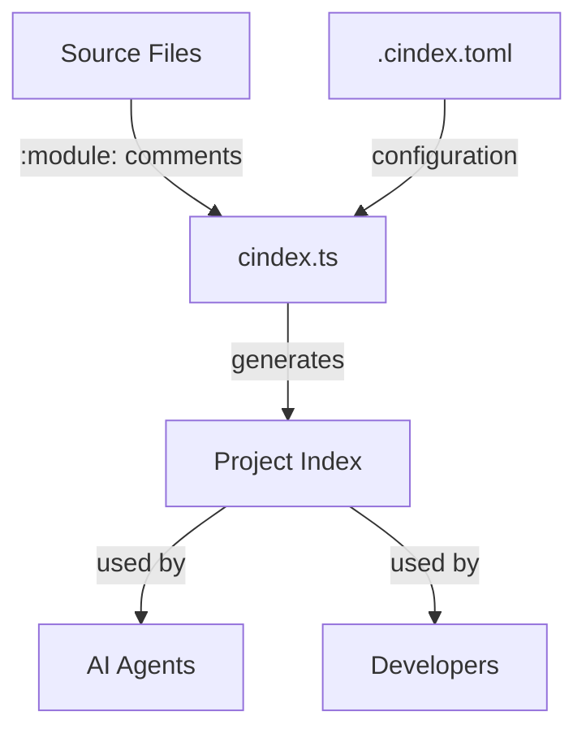

# Project Indexing System Documentation

## Overview

The cindex (Codebase Index) system provides intelligent project structure summaries to help AI agents and developers quickly navigate and understand codebases. It reduces cognitive load by summarizing repetitive patterns while highlighting important unique files.

## System Components

### 1. Core Tool: `oven/bin/cindex.ts`

- **Purpose**: CLI tool that generates project indexes
- **Features**:
  - Respects `.gitignore` patterns
  - Supports custom ignore patterns via configuration
  - Outputs in markdown format for readability
  - Extracts `:module:` descriptions from source files
- **Usage**: `cindex -m` generates markdown-formatted project index

### 2. Configuration: `.cindex.toml`

- **Location**: Project root
- **Structure**:

  ```toml
  # Ignore patterns (ripgrep format)
  iglobs = ["**.json", "**/.claude/**", "**.lock"]

  # Directory descriptions
  [descriptions]
  config = "All application configuration files"

  # Subdivisions for detailed indexing
  [[subdivisions]]
  dir = "config"

  # Subdirectory descriptions
  [subdivisions.descriptions]
  nvim = "Neovim configuration with plugins"

  # Pattern-based summarization
  [[summarise]]
  dir = "config/nvim/lua/plugins"
  pattern = "^config/nvim/lua/plugins/.*\\.lua$"
  desc = "[summary] Neovim plugin configurations"

  # Key file descriptions
  [files]
  "oven/bin/notif.ts" = "Desktop notification system"
  ```

### 3. Module Documentation: `:module:` Comments

- **Purpose**: Embed descriptions directly in source files
- **Syntax**: `:module: Description of this module`
- **Extractor**: `oven/bin/prepend-comment.ts` adds these comments
- **Example**:
  ```typescript
  // :module: GitLab Merge Request CLI Helper
  ```

## How the System Works Together



1. **Configuration Phase**: `.cindex.toml` defines ignore patterns, descriptions, and summarization rules
2. **Scanning Phase**: `cindex.ts` traverses the file system, respecting ignore patterns
3. **Extraction Phase**: Extracts `:module:` descriptions from source files
4. **Generation Phase**: Produces hierarchical markdown output with summaries

## Current Integration Points

### For AI Agents

- **Librarian Agent**: Can use `cindex -m` to understand project structure before searching
- **TDD Developer**: Can quickly locate test files and implementation areas
- **Researcher Agent**: Can identify documentation and specification locations

### For Developers

- **Command Line**: Run `cindex -m` for quick project overview
- **Documentation**: Output can be saved as project documentation
- **Navigation**: Helps new team members understand codebase organization

## Usage Examples

### Basic Usage

```bash
# Generate markdown index
cindex -m

# Save to file
cindex -m > PROJECT_INDEX.md

# Index specific directory
cindex -p config/ -m
```

### Adding Module Descriptions

```bash
# Add description to a file
prepend-comment "Desktop notification system" oven/bin/notif.ts

# Bulk add descriptions
find oven/bin -name "*.ts" -exec prepend-comment "CLI utility" {} \;
```

## Next Steps for Enhanced Integration

### 1. Agent Awareness Updates

**Action Required**: Update agent definitions to leverage cindex

#### Librarian Agent (`claude/agents/librarian.md`)

```markdown
## Project Discovery

Before searching for files, run `cindex -m` to understand the project structure.
This provides a hierarchical view with descriptions and summaries.
```

#### TDD Developer Agent (`claude/agents/tdd-developer.md`)

```markdown
## Codebase Orientation

Start with `cindex -m | head -100` to quickly understand project layout
and identify test directories before implementation.
```

### 2. Claude Code Hooks Integration

#### A. Session Start Hook (`claude/x-hooks/session-start-index.js`)

```javascript
// Automatically generate project index at session start
const { execSync } = require("child_process");

module.exports = {
  name: "project-index-generator",
  event: "session-start",
  action: () => {
    try {
      // Check if cindex exists
      execSync("which cindex", { stdio: "ignore" });

      // Generate and cache index
      const index = execSync("cindex -m", { encoding: "utf-8" });

      // Save to context
      return {
        context: {
          projectIndex: index.slice(0, 5000), // First 5000 chars
        },
      };
    } catch (e) {
      return { context: {} };
    }
  },
};
```

#### B. Agent Invocation Hook (`claude/x-hooks/agent-index-injector.js`)

```javascript
// Inject project index into agent context
module.exports = {
  name: "agent-index-injector",
  event: "agent-invoke",
  action: (context) => {
    // Only for specific agents
    const indexAgents = ["librarian", "tdd-developer", "researcher"];

    if (indexAgents.includes(context.agentType)) {
      return {
        additionalContext: `
## Project Structure
Run \`cindex -m\` to see the full project structure.
Key directories:
- config/: Application configurations
- oven/bin/: CLI utilities
- claude/: AI agent configurations
        `,
      };
    }
    return {};
  },
};
```

### 3. Automated Index Maintenance

#### Git Pre-Commit Hook

```bash
#!/bin/bash
# .git/hooks/pre-commit

# Update module descriptions for new files
for file in $(git diff --cached --name-only --diff-filter=A | grep -E '\.(ts|js|lua|nu)$'); do
  if ! grep -q ":module:" "$file"; then
    echo "Warning: $file lacks :module: description"
  fi
done

# Regenerate index if config changed
if git diff --cached --name-only | grep -q ".cindex.toml"; then
  cindex -m > claude/x-agent-docs/project-index.md
  git add claude/x-agent-docs/project-index.md
fi
```

### 4. Enhanced Features Roadmap

#### Phase 1: Search Integration

- Add `-q <query>` flag to cindex for searching within index
- Integrate with fzf for interactive navigation
- Support for tags/keywords in descriptions

#### Phase 2: Dynamic Updates

- File watcher to update index on changes
- Incremental indexing for large projects
- Cache mechanism for faster subsequent runs

#### Phase 3: AI Enhancement

- Auto-generate descriptions using AI for undocumented files
- Suggest summarization patterns based on file patterns
- Detect and highlight architectural patterns

## Testing Effectiveness

### Metrics to Track

1. **Agent Performance**: Time to find relevant files
2. **Accuracy**: Correct file identification rate
3. **Coverage**: Percentage of files with descriptions
4. **Maintenance**: Frequency of index updates needed

### Test Scenarios

```bash
# Test 1: Find specific functionality
time bash -c "cindex -m | grep -i notification"

# Test 2: Agent navigation test
claude-code "Use cindex to find the dotfile management system"

# Test 3: New developer onboarding
cindex -m > onboarding.md
```

## Configuration Best Practices

### 1. Ignore Patterns

- Always ignore generated files (`*.lock`, `node_modules/`)
- Exclude test fixtures and data files
- Skip binary and media files

### 2. Summarization Strategy

- Group files with similar purposes
- Use patterns for generated or repetitive files
- Keep unique/important files visible

### 3. Description Guidelines

- Be concise but descriptive
- Include primary functionality
- Add cross-references where helpful
- Use consistent terminology

## Troubleshooting

### Common Issues

#### Index Too Large

- Add more summarization patterns
- Increase ignore patterns
- Consider splitting into sub-indices

#### Missing Descriptions

```bash
# Find files without :module: comments
rg -L ":module:" --type ts oven/bin/
```

#### Stale Index

```bash
# Add to your shell profile
alias reindex="cindex -m > claude/x-agent-docs/project-index.md"
```

## Integration Checklist

- [ ] `.cindex.toml` configured with appropriate patterns
- [ ] Key files have `:module:` descriptions
- [ ] Agents updated to use `cindex -m`
- [ ] Session start hook implemented
- [ ] Git hooks configured for maintenance
- [ ] Team documentation updated

## Conclusion

The cindex system provides a powerful foundation for AI-assisted development by making project structure intelligible and navigable. With proper configuration and integration, it significantly reduces the time agents and developers spend searching for relevant code, allowing them to focus on understanding and implementing functionality.

For questions or improvements, see:

- Tool source: `oven/bin/cindex.ts`
- Configuration: `.cindex.toml`
- This documentation: `claude/x-agent-docs/project-indexing-system.md`
