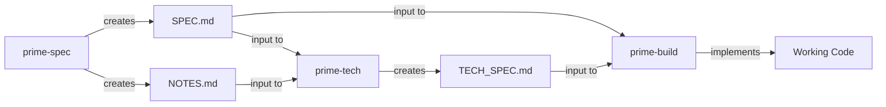

# Specification Patterns and Document Structure

This document defines the file naming conventions, relationships, and lifecycle of specification documents across the prime-\* workflow phases for use with agentic tools

## File Naming Convention

All specification documents follow a consistent naming pattern:

```
specs/<numerical-id>-<kebab-cased-feature>.<document-type>.md
```

### Components:

- `numerical-id`: 3-digit incremental number (001, 002, etc.)
- `kebab-cased-feature`: Feature name in kebab-case
- `document-type`: Optional suffix indicating document type

## Document Types

### 1. Feature Specification (SPEC)

**Pattern**: `specs/<numerical-id>-<kebab-cased-feature>.md`
**Example**: `specs/001-user-authentication.md`
**Created by**: `/prime-spec` command
**Contains**: WHAT needs to be built - user requirements, acceptance criteria, success metrics
**Template**: `specs/SPEC_TEMPLATE.md`

### 2. Technical Notes (TECH_NOTES)

**Pattern**: `specs/<numerical-id>-<kebab-cased-feature>.notes.md`
**Example**: `specs/001-user-authentication.notes.md`
**Created by**: `/prime-spec` command (during spike work)
**Contains**: Technical discoveries, POC findings, constraints discovered during specification phase
**Format**: Informal notes and findings

### 3. Technical Specification (TECH_SPEC)

**Pattern**: `specs/<numerical-id>-<kebab-cased-feature>.tech.md`
**Example**: `specs/001-user-authentication.tech.md`
**Created by**: `/prime-tech` command
**Contains**: HOW to build it - architecture decisions, implementation approach, technology choices
**Template**: `specs/TECH_SPEC_TEMPLATE.md`

## Document Relationships



## Phase Responsibilities

### Phase 1: Specification (`/prime-spec`)

**Inputs**: Feature description from user
**Outputs**:

- Primary: `<id>-<feature>.md` (SPEC)
- Optional: `<id>-<feature>.notes.md` (TECH_NOTES)

### Phase 2: Technical Design (`/prime-tech`)

**Inputs**: Path to SPEC file (e.g., `specs/001-feature.md`)
**Reads**:

- The specified SPEC file
- Corresponding TECH_NOTES if exists (derives name by adding `.notes.md`)
  **Outputs**: `<id>-<feature>.tech.md` (TECH_SPEC)

### Phase 3: Implementation (`/prime-build`)

**Inputs**: Path to SPEC file (e.g., `specs/001-feature.md`)
**Reads**:

- The specified SPEC file
- Corresponding TECH_SPEC (derives name by adding `.tech.md`)
- Corresponding TECH_NOTES if needed (derives name by adding `.notes.md`)
  **Outputs**: Implemented code per specifications

## Directory Structure Example

```
specs/
├── SPEC_PATTERNS.md           (this file)
├── SPEC_TEMPLATE.md           (template for specifications)
├── TECH_SPEC_TEMPLATE.md      (template for technical specs)
├── 001-user-authentication.md
├── 001-user-authentication.notes.md
├── 001-user-authentication.tech.md
├── 002-payment-processing.md
├── 002-payment-processing.notes.md
└── 002-payment-processing.tech.md
```

## State Transfer Between Phases

Each phase operates independently but follows these conventions:

1. **Explicit Arguments**: Each command receives explicit file paths
2. **Deterministic Naming**: Related files use predictable suffixes
3. **Self-Contained Documents**: Each document contains all necessary context
4. **Progressive Enhancement**: Each phase adds detail without modifying previous outputs
